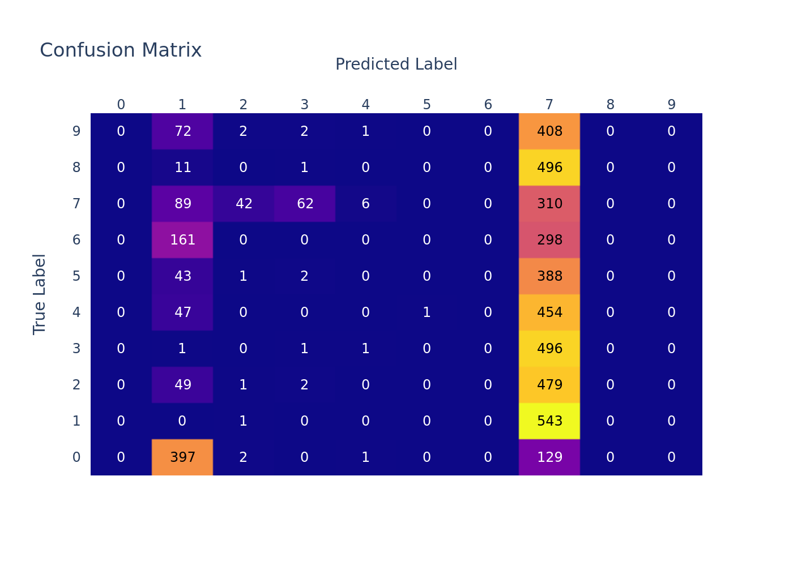
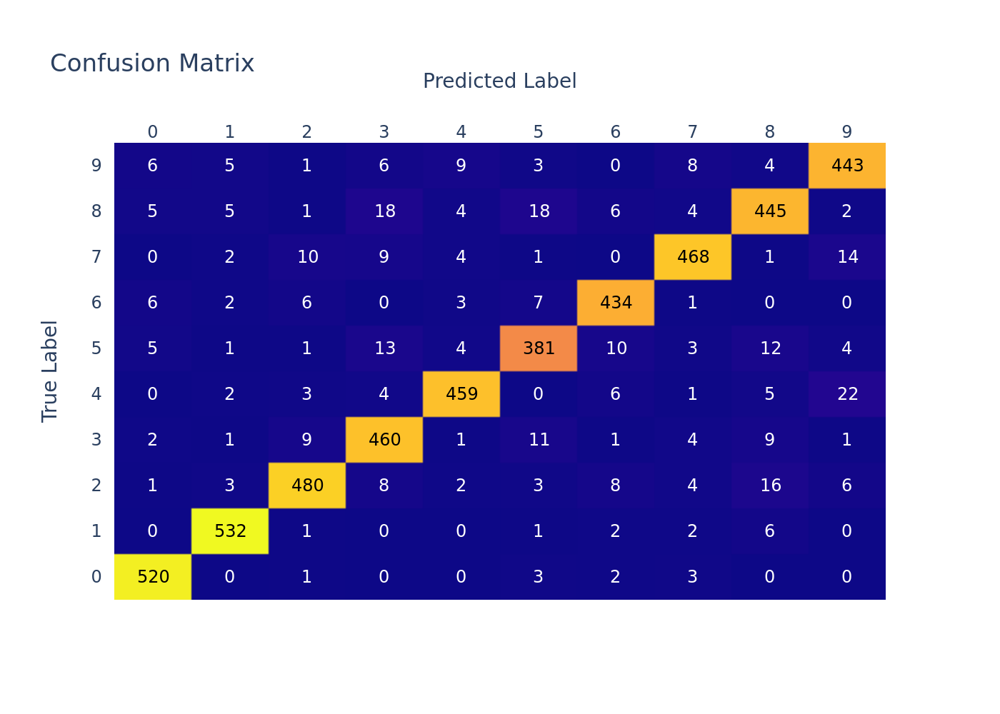

# 1-basic-pytorch

| Dataset | Model |
|-|-|
| MNIST | My Custom Conv Model |

## Goal
- Learn how to train with PytorchLightning
- Learn how to make confusion matrix
- Learn how to log with wandb logger

## Result

### Confusion matrix

| not trained | trained |
|-|-|
|  |  |


# 2-basic-nlp

| Datset | Model |
| - | - |
| ag_news | just FC layers |

## Goal
- Implement white-space based Tokenizer
- Learn how to train model with natural language strings

## Result

### MyTokenizer

<details>
    <summary>Click to open code section</summary>

``` python
class MyTokenizer:
    def __init__(
        self,
    ):  
        self.pad_token_id = 0
        self.pad_token = "<pad>"

        self.unk_token_id = 1
        self.unk_token = "<unk>"
        
        self.__token_to_id = {self.pad_token: 0, self.unk_token: 1}
        self.__id_to_token = [self.pad_token, self.unk_token]
        
        self.vocab_size = 2
    
    def __call__(
        self,
        text: Union[str, List[str]],
        max_length: Optional[int] = None,
    ):
        return self.tokenize(text, max_length)
    
    def tokenize(
        self, 
        text: Union[str, List[str]], 
        max_length: Optional[int] = None, 
        add_new_tokens = False,
    ):  
        if type(text) is str:
            return torch.tensor(self.__tokenize_one_sentence(text, add_new_tokens), dtype=torch.long)
        else:
            if max_length is None:
                max_length = max(map(lambda sentence: len(self.__tokenize_one_sentence(sentence, add_new_tokens)), text))

            result = []
            for single_text in text:
                tokenized = self.__tokenize_one_sentence(single_text, add_new_tokens)
                if len(tokenized) > max_length:
                    tokenized = tokenized[:max_length]
                else:
                    pad_len = max_length - len(tokenized)
                    tokenized.extend([self.pad_token_id] * pad_len)
                result.append(tokenized)
            return torch.tensor(result)
    
    def __tokenize_one_sentence(self, text: str, add_new_tokens: bool):
        result = []
        for token in text.split():
            if token in self.__token_to_id:
                result.append(self.__token_to_id[token])
            else:
                if add_new_tokens:
                    new_id = self.vocab_size
                    self.__token_to_id[token] = new_id
                    self.__id_to_token.append(token)
                    self.vocab_size += 1
                    result.append(new_id)
                else:
                    result.append(self.unk_token_id)
        return result
```
</details>
